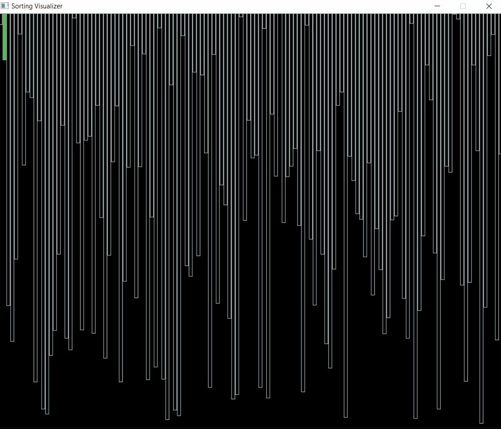

# Sorting Visualizer

A sorting algorithm is designed to arrange elements of a list in a specific order. Although there are numerous sorting algorithms available, only a few are commonly used in practical scenarios. 

In this visualizer, we will explore several of these sorting algorithms to understand their operation through visual representation. The algorithms included are Selection Sort, Insertion Sort, Bubble Sort, Merge Sort, Quick Sort, and Heap Sort.

The array size is set at 130 elements. We can generate a new random list and choose any of the sorting algorithms from the provided options to sort the list. All algorithms will arrange the elements in ascending order. Please note that the visual representation of the sorting process does not exactly match the real-time complexity of each algorithm. Faster algorithms like Merge Sort have been deliberately slowed down to make their operation clearer in the visualization.

While working on the Visualization of different sorting algorithms, we used C++ and SDL2 Library .

# Controls:-

Available Controls inside Sorting Visualizer:-
- Use 0 to Generate a different randomized list.
- Use 1 to start Selection Sort Algorithm.
- Use 2 to start Insertion Sort Algorithm.
- Use 3 to start Bubble Sort Algorithm.
- Use 4 to start Merge Sort Algorithm.
- Use 5 to start Quick Sort Algorithm.
- Use 6 to start Heap Sort Algorithm.
- Use q to exit out of Sorting Visualizer

# Samples

- Sample 1 (Insertion Sort)

[example1.gif]()

- Sample 2 (Merge Sort)

